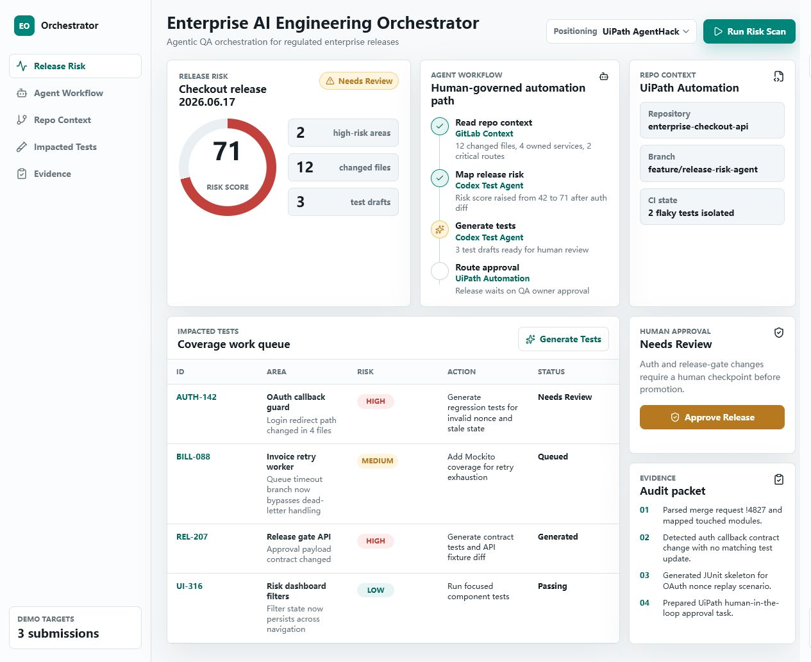

# Enterprise AI Engineering Orchestrator

Reusable hackathon MVP for June 2026 remote prize submissions.

This is a local React/Vite demo of an engineering workflow orchestration product. It helps teams assess release risk, map repository context, generate targeted tests, collect evidence, and route human approval.



## Hackathon Positioning

The same demo can be described differently per submission:

- **UiPath AgentHack:** Agentic QA orchestration for regulated enterprise releases, with UiPath Automation / Test Cloud as the governance and human-approval layer.
- **GitLab Transcend:** Repository-aware developer workflow automation using GitLab Orbit-style context, CI signals, generated tests, and a project-level GitLab Duo Agent Skill.
- **Mind the Product:** A shippable AI workflow product that lets product-minded builders validate a concrete operational pain point quickly.
- **Casper Agentic Buildathon:** Verifiable agentic release-audit receipt prepared for Casper Testnet anchoring.

## What Works

- Switch between UiPath, GitLab, and product-MVP positioning.
- Run a simulated release risk scan.
- Generate test status changes from local UI state.
- Approve a release through a human checkpoint.
- Inspect impacted tests, workflow evidence, and repository context.

## Submission Materials

- [Submission packet draft](./SUBMISSION_PACKET.md)
- [5-minute demo script](./DEMO_SCRIPT.md)
- [Devpost draft copy](./DEVPOST_DRAFTS.md)
- [Deployment prep](./DEPLOYMENT.md)
- [GitLab Transcend readiness](./docs/gitlab-transcend-readiness.md)
- [Casper Agentic Buildathon readiness](./docs/casper-agentic-buildathon-readiness.md)
- [UiPath AgentHack presentation deck](./docs/uipath-agenthack-presentation.pptx)
- [Devpost thumbnail asset](./docs/screenshots/devpost-thumbnail.png)

## GitLab Transcend Readiness

This repository is the public code artifact for the GitLab Transcend Showcase Track submission.

### Project Description

Enterprise AI Engineering Orchestrator demonstrates a repository-aware release workflow: inspect change context, estimate release risk, recommend targeted tests, collect evidence, and keep a human approval checkpoint visible before release promotion.

### GitLab Duo / Orbit Artifact

The GitLab-specific AI-native artifact is a project-level GitLab Duo Agent Skill:

- [`skills/release-risk-orbit/SKILL.md`](./skills/release-risk-orbit/SKILL.md)

The skill describes how an agent should use GitLab Orbit context from merge requests, CI, ownership, dependency, and deployment signals to produce release-risk recommendations and approval evidence.

### Current Integration Boundary

The live web demo uses safe simulated GitLab context. It does not call live GitLab Orbit, mutate merge requests, create branches, update CI settings, or write comments. If GitLab Orbit access is available, the intended next step is to run the skill with real Orbit query output and attach that evidence to the submission.

## UiPath AgentHack Readiness

This repository is the public code artifact for the UiPath AgentHack draft submission.

### Project Description

Enterprise AI Engineering Orchestrator helps enterprise engineering teams turn release context into governed QA action. The MVP ingests simulated repository and CI signals, surfaces release risk, recommends targeted tests, and routes the final decision through a human approval checkpoint.

### UiPath Components

The current public MVP demonstrates the orchestration and decision layer. The intended UiPath implementation path is:

- UiPath Test Cloud for approved validation execution.
- UiPath workflow automation for moving from release-risk review to test action.
- UiPath Labs sandbox environment for judging once access is provisioned.
- Human approval gates before agentic automation changes release state.

UiPath Labs access has been requested. The live Test Cloud adapter is pending sandbox access and is not represented as complete in this repository.

### Agent Type

Planned hybrid agent implementation:

- Coded agent logic for release-risk scoring, repository context normalization, and generated QA recommendations.
- Low-code UiPath workflow orchestration around test execution, review routing, and audit status updates.

### Setup Instructions

1. Install dependencies:

```bash
npm install
```

2. Start the local app:

```bash
npm run dev -- --port 5178
```

3. Open the app:

```text
http://127.0.0.1:5178/
```

4. Use the UiPath positioning mode in the left rail, run the release-risk workflow, inspect generated test recommendations, and approve or review the release checkpoint.

5. For production UiPath integration, replace the simulated execution adapter with UiPath Test Cloud calls after a UiPath Labs environment URL is available.

## Casper Agentic Buildathon Readiness

This repository now includes a Casper-specific extension path for a verifiable release-audit receipt.

Generate the local audit payload and hash:

```bash
npm run casper:proof
```

The script writes:

- `outputs/casper-audit-payload.json`
- `outputs/casper-audit-proof.json`

Current boundary: the payload hash is ready, but a real Casper Testnet deploy or transfer hash is still required before final DoraHacks submission. See [Casper readiness](./docs/casper-agentic-buildathon-readiness.md).

## Public Demo

- Demo: https://zemeng2015.github.io/enterprise-ai-engineering-orchestrator/
- Repository: https://github.com/zemeng2015/enterprise-ai-engineering-orchestrator

## Local Setup

```bash
npm install
npm run dev -- --port 5178
```

Open:

```text
http://127.0.0.1:5178/
```

Build:

```bash
npm run build
```

Security check:

```bash
npm audit --audit-level=high
```

## Current Submission Notes

- This version is a safe local demo. It does not call live GitLab, UiPath, Devpost, or customer systems.
- No credentials, tokens, cookies, or browser storage are collected.
- External integrations are represented as demo states and can be wired later behind explicit safety gates.
- Mind the Product final submission requires Novus.ai live instrumentation plus a hosted 2-3 minute demo video.

## License

MIT
