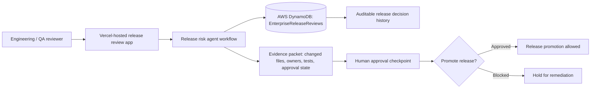

# H0 Zero Stack Architecture

## Candidate Architecture

This is the minimal honest architecture for an H0 submission if Vercel and AWS Database access are completed before the deadline.

## Data Model

Table: `EnterpriseReleaseReviews`

| Attribute | Purpose |
|---|---|
| `releaseId` | Partition key for one release review |
| `riskScore` | Numeric release-risk score |
| `approvalState` | `hold-for-human-review`, `approved`, or `blocked` |
| `changedFiles` | Files or modules involved in the release |
| `recommendedTests` | Targeted tests generated by the release-risk workflow |
| `reviewer` | Human reviewer or approver |
| `createdAt` | Initial review timestamp |
| `updatedAt` | Last decision/update timestamp |

## Remaining Proof Needed

- Published Vercel Project Link.
- Vercel Team ID.
- AWS DynamoDB, Aurora PostgreSQL, or Aurora DSQL resource actually provisioned.
- Screenshot or console evidence proving AWS Database usage.
- Demo video segment showing the Vercel app reading or writing persistent AWS-backed release review state.
