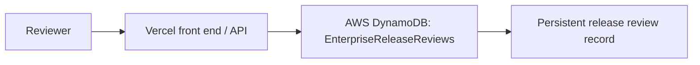

# H0 Zero Stack AWS Proof

Status as of 2026-06-24 01:12 EDT: partial external proof created.

## AWS DynamoDB Resource

- AWS account: `576640484415`
- Region: `us-west-2`
- Table: `EnterpriseReleaseReviews`
- Table ARN: `arn:aws:dynamodb:us-west-2:576640484415:table/EnterpriseReleaseReviews`
- Billing mode: `PAY_PER_REQUEST`
- Partition key: `releaseId` (`S`)

## Proof Item

- `releaseId`: `EAIO-H0-2026-06-24`
- `riskScore`: `71`
- `approvalState`: `hold-for-human-review`
- `reviewer`: `Zemeng Wang`
- `source`: `H0 minimal AWS DynamoDB proof`
- `createdAt`: `2026-06-24T05:12:35Z`

Local proof files:

- `outputs/h0-dynamodb-item.json`
- `outputs/h0-dynamodb-key.json`

## Minimal Architecture

## Remaining H0 Blocker

This is not a complete H0 submission package yet. Remaining external proof:

- Vercel project link
- Vercel team ID
- Vercel deployment connected to the app or API
- AWS console screenshot showing the DynamoDB table/item
- Demo video under 3 minutes explaining the Vercel + AWS Database flow

Do not submit H0 as complete until the Vercel proof and screenshot/video package are ready.
